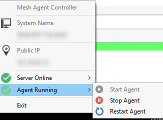

# TrayMesh
Deserved Tray Icon for MeshCentral Agent

	THIS IS A PROOF OF CONCEPT VERSION. FULLY FUNCTIONAL, BUT FAR FOR THE FINAL IDEA. 
	FOR NOW, IS JUST A BINARY FILE, AND THAT'S IS (+ 2 DLL ON WINDOWS VERSION).
	HOPEFULLY THIS WILL EVOLVE IN A WELL INTEGRATED PLUGIN FOR MESHCENTRAL, AND INSTALLER, AND A FEW CUSTOMIZABLE OPTIONS.
	
	
This is made on [CodeTyphon](https://www.pilotlogic.com/sitejoom/index.php/wiki/84-wiki/codetyphon-studio/72-codetyphon-about), which is actually a fork of [Lazarus](https://www.lazarus-ide.org/), being both IDEs for Free Pascal (A programming language that I found great)

**Features:**

   * Shows System name (in an intent to provide some info to the customer on attended remote support. You know, teamviewer style)

   * Shows Public IP (same)

   * Shows connection with server (URL taken from Regedit -on Windows- and .smh file -on Linux)

   * Shows Agent service status (and you can start/stop/restart it)

   * English and Spanish languages (At least for now. There is just a few strings in the code)
   
   * Windows and Linux versions
   ------------

**Screenshot:**

	
------------

**Future ideas:**

* Full integration via plugin, allowing the server to offer a teamviewer-style ID and password to the clients
* Continuing the previous concept, a full gui window (not just tray icon) showing those ID and password
* Definitely an installer for better integration. This installer should be pushed by the server itself via the mentioned plugin. It could wrap the agent installation, this program, and possibly a -very- slightly modified version of VNC (To be used only for MeshCentral. Better remote performance for long remote sessions)
* Allow costumer to ask for assistance opening a ticket directly from this program. 
* Also, allow them to open the MeshCentral chat
* Add GUI to the temporary mode too (should also wrap the original agent window)
* Suggestions?
